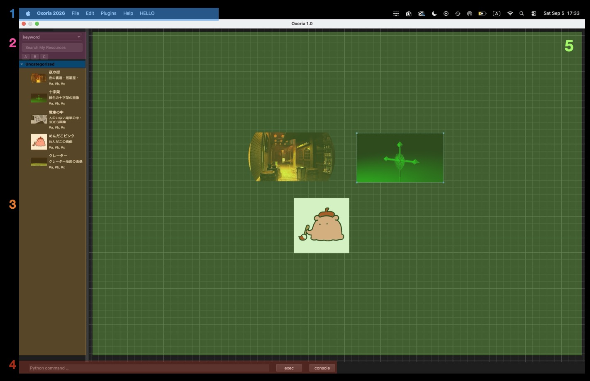
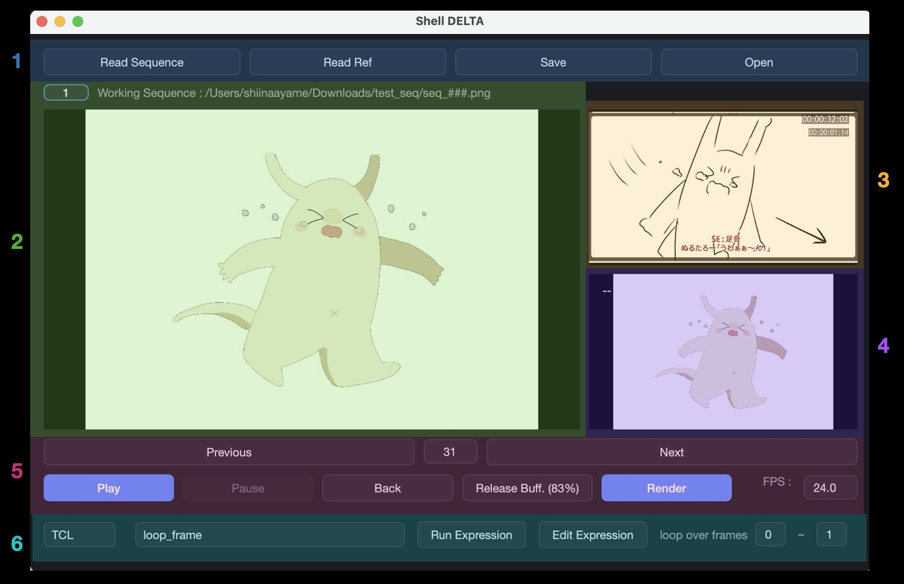

# 作品一覧

- **クリエーターのためのリファレンスコレクションツール** - [Oxoria](#oxoria)
- **セルアニメの制作パイプラインを支える** - [ShellArc](#shellarc)
- **アニメコマ打ちとタイムライン操作に特化したツール** - [Shell DELTA](#shell-delta)
- *GPUネイティブの高速映像規格** - [NUDEC](#nudec)

> 各プロジェクトの詳細なディレクトリ構造は、同じディレクトリの [tree.md](./tree.md) を参照してください。

---

# Oxoria

リポジトリ：[Oxoria](https://github.com/shinonome-MiDUki/oxoria)
ドキュメント：[Oxoria Docs](https://github.com/shinonome-MiDUki/oxoria/blob/main/README.md)

PureRef など、既存のリファレンスソフトへの不満足により開発したソフトウェアです。

既存の同類ソフトにない、**リファレンスライブラリ、セマンティック検索、スクリプトによるカスタマイズ、ヘッドレス操作などの機能**が搭載されています。

`pip install oxoria` でクイックスタート

`oxoria` で起動

`oxoria --reset` または `oxoria -r` でリセット

**担当箇所**：基本全部（8月25日から外部プルリクエストを受け付けはじめ、後ほどOSSプロジェクトとして発表予定）

## UI紹介

1. メニューバー
2. 検索バー
3. リファレンスライブラリ
4. コマンドエディター
5. キャンバス

## リファレンスライブラリ

ユーザーはリファレンス画像にキャプションをつけて、自分のリファレンスライブラリに登録することができます。

ライブラリに登録されたリファレンスは将来も使うことができます。

もちろん登録せずキャンバスに配置することも可能です。

**今後：**

1. タグ機能を実装したい
2. Florence-2 などの軽量な VLM モデルを組み込むことで、キャプションを自動提案できるようにしたい
3. 現在キャンバス拡大縮小は`Ctrl + +`と`Ctrl + *`で対応していますが、マウスやタッチパッドで直感的にサイズ変更できるようにしたい

## セマンティック検索

リファレンスライブラリが膨大になってしまっても、欲しいリファレンスを簡単に見つけ出すために、セマンティック検索を実装しています。

例えば、「神」と検索したら、「神社」や「巫女」などのキーワードもヒットされます。

**軽量な sentence transformer モデルをもとに、tokenizers、onnxruntime と faiss-cpu を用いて実現しています。**

もちろん従来のキーワード検索も使用可能です（difflib.SequenceMatcher を通じて Ratcliff-Obershelp アルゴリズムで実装）。

**工夫点：**
当初、モデルサイズ300MB以下、ソフト起動時間4秒以内という制約を課していたので、最適化のため様々な工夫をしました。

1. paraphrase-multilingual-MiniLM をモデルとして採用しており、元のモデルサイズは480MBもあり、制約を超えてしまったため、optimum.onnxruntime を AVX-512 VNNI 命令セットでモデルの重みを FP32 から INT8 に圧縮し、動的量子化を行った上で、ONNX変換を行うことで**精度を落とさずにモデルサイズを 289MBに抑えました**
2. 当初はランタイムで transformers と optimum.onnxruntime を使用しており、AutoTokenizer などの便利な組み込む関数があるものの、ライブラリ自体が巨大なため、起動時間が8秒であり、メモリ使用量も理想的ではなかった。そのため、tokenizers と onnxruntime といったより低レベルで軽量なライブラリに移行し、AutoTokenizer などの効果を自前実装することで、**アプリの起動時間を2秒程度の抑えた。**

**今後：**

1. 開発に使った重いライブラリを配布パッケージから徹底的に排除し、配布物のサイズを減らしたい

## スクリプトによるカスタマイズ

本ソフトは、UIとバックエンドロジックの分離を徹底しており、UI上の全ての操作は、cmdディレクトリ下にあるクラスの関数に対応する。

AppAPI（アプリ全体に関する操作）、CanvasAPI（キャンバス操作）、ConfigAPI（設定内容の操作）、CvAPI（OpenCV実行基盤）、IoAPI（ファイル操作）、PackageAPI（プラグイン管理と操作）、ResourcesAPI（リファレンスライブラリ操作）、SearchAPI（検索機能へのアクセス）が提供されています。

よって、標準UIを経由せずに、ユーザーは関数を呼び出すことで、自分のワークフローに最適なカスタムスクリプトやカスタムUIを作成することができます。

PackageAPI というクラスも用意されており、`__oxoplugin__.py` というエントリポイントを定義するだけで、**自分のツールを Oxoria のプラグインとして登録することができます。**

Oxoria のソースコードを一行も変更せずに、さまざまな拡張機能が実装可能です。

また、UI要素の見た目や各デフォルトパラメータ値、そしてメニューバーの配置も、全てjsonファイルで管理されており、ユーザーがカスタム化することができます。

さらに、プログラマブル画像処理も実装されており、コンテキストメニューから直接opencvのコードを選択中の画像に対し実行することができます。

これにより、制作したいアートスタイルによって、リファレンスの見た目を柔軟に調整・変更することが可能です。

**工夫点：**
プラグイン優先の設計のため、「プログラミングができないと使いづらい」ことになりがちですので、**プログラミング経験のないアーティストやデザイナーも簡単に使用できるように UX面の工夫をしました。**

1. バニラの状態でもスムーズに使えるように、基本的な機能をstd_menu_cmdとしてまとめ、デフォルトのメニューバーから使えるようにするなど、スクリプトを書かなくても使用できるようにしています
2. インアプリのスクリプト実行環境が整備されており、画面下部にあるコマンドラインにスクリプトを実行することができ、コンソール出力を開くこともできます。また事前に設定画面でコードエディタの実行ファイルパスを登録しておけば、好きなコードエディタを開いてスクリプトを作成することも可能です。「>数字」で前に実行したコードを呼び出したり、「:アルファベット」でショートカットに登録されたスクリプトを実行したりすることもできます。
3. モノクロ化などの常用な画像処理は、ワンクリックで出せるように標準搭載されています
4. メニューのAPIリファレンスから、HTMLのドキュメントファイルをブラウザで開くことができ、いつでも参照できるリファレンスを用意しています

## ヘッドレス操作

アーティストは作品を制作していなくても、普段ネットで「今後参考になりうる」画像を見かけることが多いことから生まれた機能です。

この機能をオンにしたら、メインアプリを閉じても、アプリを起動せずに Ctrl+O キーでスクリーショットして、そのまま自分のリファレンスライブラリに入れることができます。

## 重複検出

画像の画素に基づくハッシュをライブラリにある各画像に付与しており、同じ画像の重複登録を避けます。

 

═══════════════════════════════════════

 

# ShellArc

リポジトリ：[ShellArc](https://github.com/QU-miteiken-shelltech/Shell_Arc)
ドキュメント：[ShellArc Docs](https://github.com/QU-miteiken-shelltech/Shell_Arc/blob/main/README_jpn.md)

ShellArc は、単なるアセット管理アプリではなく、**日本アニメ制作のレイアウト、原画から撮影、編集までの全工程を管理するバックエンドフレームワークライブラリです。**

**未定研という105人が所属している自主制作アニメーション企画の制作現場を現役で支えているフレームワークです。**

**担当箇所**：基盤コードの全部（PyCon JP 2026 を経て外部プルリクエストを受け付けはじめ、プルリクエストのレビューワーを担当しています）

未定研では、去年までDropboxやメガファイル便のリンクの送り合いでデータを管理していましたが、部員数の大幅な増加により、手動管理の破綻が露呈し、データ構造がカオス化し、データフローも破綻しはじめました。

そこでパイプラインの整備とパイプラインツールの開発を提案し、ShellArc の発端となり、同時に部内技術機関である ShellTech も設置しました。

ShellArc の中核である shellarc_core モジュールを中心に、Discord ボットとデスクトップアプリケーションをフロントエンドとして展開しています。

## Gitを用いた強力なバージョン管理機能とユーザー体験の両立

shellarc_core の本質はアニメ制作に特化した特殊なGitサーバーバックエンドです。

アニメ制作において、過去の修正バージョンを参照したい、または戻したいという状況が多く、また割り振り済みのカット、提出済みのカット、検査済みのカットなどといった、多岐にわたる状態の管理も必要であるため、**Gitの強力なバージョン管理の考え方をアニメ制作のワークフローに転用することで対応しました。**

巨大なアセットファイル本体は Cloudflare の R2 ストレージに保存し、サーバー上のGitリポジトリでは Cloudflare R2 でのオブジェクトへのポインタを管理するようにしています。

Gitの操作は、アニメ制作の各工程として再解釈され、一個一個の関数としてラッピングされています。

例えば「作画監督確認」という作業は、「pendingブランチにあるファイルをmainブランチにマージしコミットする」ことになります。

これにより、アーティストはGitを全く意識しなくても、`..up`（アップロード）、`..dl`（ダウンロード）、`..appr`（作監検査）などの直感的な Discord コマンドでシステムをスムーズに利用できます。

**工夫点：**

1. アーティストや制作進行などのユーザーに寄り添い、いかに「ユーザーの負担を減らすか」という課題に注力しました。例えば Discord には容量制限があるため、別の大容量ファイルアップロード用ウェブアプリを作る考えもあったが、「別のアプリに移行する」手間を省くために、**Discord から直接署名付き URL を埋め込んだ HTML ファイルを発行できるようにし、ファイルをダウンロードしクリックするだけでブラウザで簡易なアップロードUIが立ち上がるようにしました。**
2. 一般ユーザーにとっての使いやすさを維持しつつ、保守者や管理者などがより高度な操作ができるために、**SAPYC（ShellArc Python Binding Command）という内部エクスプレッションシステムを開発し、フロントエンドから安全に ShellArc コアにあるより高度なメソッドを実行することができます。**

## 四回にわたるリファクタリング

ShellArc が今の形になるまで、アーティストの使用体験とシステムの保守性を向上させるために、4回のリファクタリングを経験しました。

- **初代**：Streamlit のフロントエンドと Firebase を用いた自作の簡易バージョン管理ロジック → 既存のDiscordワークフローを捨てたくないという要望により二代目へ
- **二代目**：Discord ボットをフロントエンドに据え、「作品づくり新歓」という「一日でアニメを制作する」自部の新歓イベントで実運用（ドッグフーディング）→ フロントエンドとバックエンドの密結合、そして過度に複雑な依存関係によるコードの保守性と柔軟性の低さが露呈し三代目へ
- **三代目**：コアロジックを書き直し、階層構造のライブラリ形式を正式的に採用（「フロントエンド＞ビジネスロジック層＞クラウドIO層＞クラウド認証層＞設定層＞例外処理層」の一方向の依存関係）・Dockerの導入 → Firebaseの自作簡易バージョン管理は大規模なプロジェクトにおいて堅牢性に欠けることより四代目へ
- **四代目**：Gitを用いたコアロジックを正式的に実装 → 本番運用へ
- **五代目（現在開発中の次期リリース `dev_2027`）**：インターフェースの実装による依存性注入の実現・包括的なテストコードとモック関数の実装

## 現場のためのツールを目指して

現場の役に立つツールを目指して、アニメ制作のワークフローとアーティストの作業を理解し、様々な工夫をしました。

1. **柔軟な対応ができるシステム**：変化が多い制作現場に備え、「ツール側のせいでできない」ことをなくすために、ハードコードをなるべく避け、プロジェクトによって変わる設定を独立した設定ファイルで管理し、設定層のコードで処理しています。また、「カットごとに異なるアセット数」、「急遽新しいカットを入れることによるカット番号のずらし」、「他カットの素材の流用」なども標準機能で簡単に可能になっています。
2. **バックエンド独立のライブラリ形式がもたらすフロントエンドの自由度**：バックエンドとフロントエンドが分離されているため、実際の需要に応じて、新しいツールを素早く開発することができます。例えば未定研では、「ローカルで提出された素材を一括ダウンロードしたい」という監督と撮影・編集担当からの要望があり、通常の Discord ボットと全く同じ shellarc_core バックエンドを持つ ShellArc Desktop を開発しました。

## クリエーターファーストのアプローチ

制作管理のツールは、制作の中心であるクリエーターに安心して使ってもらえないと意味ありませんので、クリエーターの使用体験を最優先にしたアプローチを取っています。

「The most profound technologies are those that disappear」という考え方をもとに、クリエーターになるべき新しい認知コストをかけずに、クリエーターの作業体験とチーム全体のワークフロー効率を改善できるツールを目指しています。

1. **クリエーターが使い慣れているワークフローとプラットフォームを捨てない**：新しいツールに慣れさせるのではなく、できるだけ既存のワークフローを破壊せずに、新しいシステムを取り付ける考え方に則っています。例えば、未定研での ShellArc フロントエンドは、部内の制作で使ってきた Discord の拡張機能として実装されており、人事管理やスケジュール管理の可視化のために、ずっと使用されてきた Google Sheets とも連携しています。
2. **専門用語の排除**：クリエーターが制作に専念できるように、ShellArc 内部の技術的、専門的な用語をできるだけユーザーに見せないようにしています。例えば ShellArc の例外クラスでは、操作ミス、設定ミスなどを直感的なメッセージとして表示し、想定外のエラーまたはクリエーター側で自力で解消できないエラーなどは、技術班に誘導するようにしています。
3. **かかる手間をなるべくエンジニア側で吸収する**：デスクトップアプリをインストール・セットアップするためにシェルスクリプト、自動アップデートのためのストリーミングロジックなどを実装することで、ツールの導入・利用負担を最小にしています。
4. **ヒアリングとフィードバック**：クリエーターの要望を真剣に聞き、早期に形にしてシステムに組み込むことを心がけています。

## オープンソース化

ShellArc は未定研発のオープンソースフレームワークですので、運用だけでなく、OSSプロジェクトとしての宣伝にも力入れています。

**7月に開催された日本最大級の Python カンファレンスである PyCon JP で、スプリントリーダープロジェクトとして参加し、初めての外部開発者によるコントリビュートを獲得しました。**

**11月に開催されるオープンソースカンファレンス山口にも登壇する予定です。**

また、外部からの AI エージェントによるプルリクエストも現れたため、プロジェクトの設計思想を固め、生成AI対応も急いでいます。

 

═══════════════════════════════════════

 

# Shell DELTA

リポジトリ：[Shell DELTA](https://github.com/QU-miteiken-shelltech/Shell_DELTA)
ドキュメント：[Shell DELTA Docs](https://github.com/QU-miteiken-shelltech/Shell_DELTA/blob/main/manual.md)

既存の After Effects などでは実現しにくい、あるいは手間がかかる**柔軟なコマ打ちと複雑なタイムリマッピングに特化した**、ShellTech 内製のセルアニメーションタイムライン編集ソフトです。

PySide6（GUIフレームワーク）とOpenGLをベースとしたソフトです。

## UI紹介

1. インポートボタン
2. メイン映像ウィンドウ
3. リファレンス映像（Vコンなど）ウィンドウ
4. 連番画像参照ウィンドウ（どの連番画像がどんな見た目なのか、メイン映像をいじらずに確認できる）
5. プレイボタン
6. エクスプレッションエディタ

## クリーンコードへの配慮

コードと関数責務の分離を徹底し、どの機能のコードをどこで参照できるかがすぐわかるようなコード構成に心がけています。

各関数の入力、出力と処理や副作用を明確にし、アプリケーションを拡張する際、新しいロジックをスムーズに既存のロジックに挟めるようにしています。

また、巨大化したUIコードは mixim の手法を使って分割し、より保守しやすいコードにリファクタリングしました。

## GPUを駆使した描画

大量な連番画像を安定して30fpsでリアルタイムで再生するために、**標準の QImage ではなく、OpenGL を用いてより低レベルから再生システムを実装しました。**

当初はリアルタイムで OpenGL テクスチャを生成し描画していたが、通常の編集作業中では動作するものの、CPUからGPUへのデータ転送コストとOpenGLコンテクストスイッチコストがかかり、リアルタイム再生ではコマ落ちが発生しました。

そのため、すべての連番画像をあらかじめテクスチャ化しVRAMに転送し、再生時はVRAMでのテクスチャへのポインタの配列をスイッチすることで最適化を図りました。

しかし、連番画像の合計サイズが巨大になってしまうと、VRAMが圧迫してしまうため、**編集時はリアルタイムテクスチャ生成で、再生時は事前生成とキャッシュという二アプローチを併用しており**、再生後のキャッシュクリアとメモリ解放にも心がけています。

また、連番画像を内部でインデックスで管理しているため、使い回しの場合でもメモリ消費は1枚分です。

テクスチャがキャッシュされている間、新規テクスチャを生成するとコンテキストスイッチによりキャッシュされたテクスチャがC++側で破棄され、アプリ側でそのポイントを参照しようとするとOSのセグメンテーションフォルトを引き起こしてしまいました。

それに対応すべく、**メモリにテクスチャポインタがキャッシュ保持されている間はテクスチャ生成ではなくポインタのスイッチを強制し、コンテキストスイッチを禁止するロジックを実装しました。**

## エクスプレッションシステム

タイムリマッピングは、規則的な操作が多いため、**TCL と CEL の二つの言語によるエクスプレッションシステムを提供しています。**

TCL はより複雑な関数を記述することができ、CEL は気軽に書ける一行エクスプレッションに特化しています。

また記述したTCL関数をプロジェクトファイルに埋め込み、他の作業者に配布することもできます。

エクスプレッションが書けないクリエーターもスムーズに利用できるように、ループや三コマ打ちなどの常用なパターンをプリセットとして標準搭載しています。

## 今後について

まだ開発早期のため、不完備なところが多く、今後も改善していきたいところが多く残っています。

1. **外部統合**：nostal.net という画像処理ウェブアプリの作者からコード利用の許諾を得て、そのカラーグレーディンとエフェクトのシェーダーコードをプラグインとしてShell DELTAに搭載し、総合撮影ソフトウェアに仕上げる予定です
2. **スクリプティング機能**：ロジックとUIの分離を見直し、Pythonなどのスクリプト言語でカスタム化できるようにしたい
3. **レイヤー・タイムシート対応**：マルチレイヤー描画とCSV形式のタイムシートに対応する予定です
4. **ストリーミングロード実装**：連番画像が膨大になると、物量的にVRAMが限界を迎え、オーバーフローしてしまいますので、連番画像をチャンクに分けて、バックグラウンドストリーミングロードで解決していきたい

 

═══════════════════════════════════════

 

# NUDEC

リポジトリ：[NUDEC](https://github.com/QU-miteiken-shelltech/Shell_NUDEC/tree/e38de47e78007f45597737ee6308010ef4343e4f)

Shell DELTA の高速描画エンジンとして開発したもので、のちコンテナ規格プロジェクトとして独立したものです。

**KTX2 テクスチャ圧縮規格を用いた ShellTech 製の GPU ネイティブメディアコーデックとコンテナであり**、今まで使用してきた VDMX の代わりに、未定研の次世代劇場上映システムコアと予定されているものです。

**なお仕様とパイプライン設計は自分で行なったものの、エンコーダの初期実装とCMake コンフィグは生成AIを活用しています。**

## コンセプト

CPU負担をなるべく減らし、GPUをフル活用した映像再生規格をコンセプトとしています。

技術的にはテクスチャを KTX2 に準拠し圧縮することで、クオリティを維持しつつ VRAM 使用量を抑えています。

またオーバーフローを避けるためにチャンクごとのストリーミングローディングを採用しており、各チャンクは texture array として管理されるため切り替えが極めて高速である。

## パイプライン

**エンコード：**
PNG連番画像 → KTX2で圧縮 → N枚ごとに一個のチャンクにする → 全てを `.nuanim` バイナリファイルに書き込む

**デコード（再生）：**
プレーヤーから再生 → Python から OpenGL コンテキストを宣言 → C++ にコンテキストバンドルを渡す → C++でコンテキストを設定 → VBOを定義 → C++で `.nuanim` バイナリヘッダーを読み込む → チャンク0と1を OpenGL 3D Texture に変換 → `std::array<GLuint, 2>` に書き込み PyBind11 経由で Python に渡す → Python がテクスチャを参照 → VBO経由でレイヤーを切り替える → チャンク0の再生が終わった時点で C++ に更新命令 → C++が2チャンク目を処理し、`[1チャンク目, 2チャンク目]` の `std::array<GLuint, 2>` を返す → 以上を繰り返す

**終了処理：**
上映終わり → Textureを破棄 → VRAM 解放 → ガーベジコレクション

現在はエンコーダとデコーダを実装しており、これからは PyBind の実装に進みます。